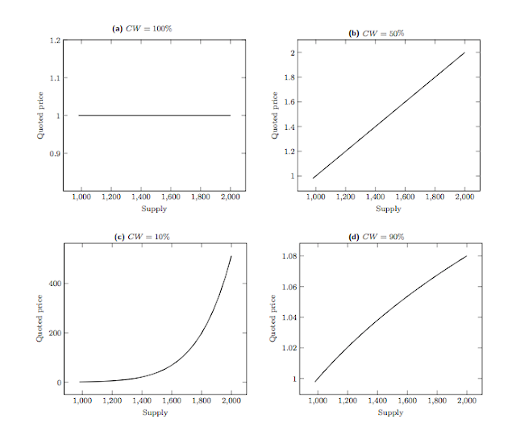

# bancor

## 개요

EOS에서 [RAM](../r/ram.md) 마켓의 유동성을 공급하기 위한 알고리즘이다. 

뱅코르 라고 부른다. 이오스에서 구현된 램마켓 같은 경우 제 3자가 개입을 해서 수수료를 매기는 방식이 아닌 수학적 알고리즘으로 인하여 시세가 유동적으로 변할 수 있게 만들어진 알고리즘이다. [smart contract](../s/smart-contract.md) 으로 구현되어 있다.

## 유동성

유동성이란? 수요와 공급이 있는 시장에서 수요가 급증할때 가격이 폭등하지 않고,  공급이 급등할때 가격이 너무 폭락하지 않아서 시장에서 자원과 재화가 원활히 순환되게 할 수 있는 것

### 유동성이 필요한 이유

유동성이 풍부한 시장일 수록 시장 충격에서 좀더 유연하게 버티거나 회복및 대응할 수 있다.

### 이오스에서 램마켓 유동성이 필요한 이유

이오스의 3대 자원 요소중 하나인 [RAM](../r/ram.md) 같은 경우 한정된 자원이다. 이오스에서 [DApp](../d/dapp.md)을 이용하기 위해서는 경우에 따라 [RAM](../r/ram.md) 이 많이 필요한 경우가 있으므로 사재기로 인하여 가격이 폭등하는것을 방지하기 위함이다. 반대로 폭락할때도 문제가 생기는데, 램 구매후 시간이 지나면 값이 폭락하여 램 구매 자체를 꺼릴수 있기 때문에 시장 자체가 죽어버릴 가능성도 있기 때문이다.

## 뱅코르 알고리즘 학습하기

### 뱅코르 알고리즘에 사용되는 용어

* `EOS Token` : 실제 메인넷에서 사용하는 화폐
* `Smart Token` : EOS Token 으로 램을 구매 한뒤 대신 받는 토큰, 가격에 따라 받는 수량이 변경됨
* `EOS Token Supply` : 램 구매시 지불했던 총 EOS Token의 수량
* `Smart Token Supply` : Smart Token 의 총 발행량
* `Smart Token Price` : Smart Token의 가격 
* `Connecting Weight`  : 지불한 EOS Token 대비 Smart Token의 총 가치의 비

$$
Connecting Weight  = \frac{ EosToken Supply}{Smart Token Supply * Smart Token Price}
$$

$$
Smart Token Price = \frac{EosTokenSupply}{SmartTokenSupply*ConnectingWeight}
$$

`Smart Token`의 경우는 사용자에게 직접적으로 노출되는 토큰은 아니다. 알고리즘 내에서 가격을 책정하기 위하여 내부적으로  [RAM](../r/ram.md) 마켓 내에서만 사용하는 토큰이다. 

`Eos Token Supply`의 경우 메인넷에 발행된 총 토큰의 수량을 의미하는것이 아니라, 램을 구매할때 지불했던 이오스 토큰의 총 수량을 의미 한다.

`Connecting Weight` 의 경우 줄여서 CW 라고 한다. CW는 뱅코르 알고리즘의 유동성을 반영하기 위한 고정된 상수값이며 직접 지정한다. 각 지정된 숫자값에 의하여 변동되는 값은 위 사진과 같다. 

위의 내용까진 크게 어려운 부분은 아니다. 요약하자면 `CW` , `Smart Token Supply` , `EOS Token Supply` 를 미리 지정해 놓으면 알고리즘에 의해서 매매시 동적으로 금액이 변한다는 것이다. 그러나 여기에는 치명적인 문제가 있다. 바로 대량으로 한방에 구매시 전체 금액이 바로 반영되지 않는다는 점이다. 예를들어 100원짜리 물건이 있는데 1개씩 살때는 수요에 의해서 가격이 조금씩 올라가지만, 한번에 물건을 전부 구매해 버리면 가격 전체 반영이 되지 않은채 모든 물건을 100원에 사는 경우가 생겨 버린다는 것이다. 이를 해결 하기 위하여 적분을 사용하여 공식을 유도한다.

$$
SmartTokenIssued = SmartTokenSupply * \begin{Bmatrix}  \left( 1 +\frac{ 지불할 Eos Token }{Eos Token Supply}  \right) ^{cw} -1  \end{Bmatrix}
$$

$$
EosToken Paid Out =  Smart TokenSupply *   \left(  
 \sqrt[cw]{   1 + \frac{지불할 SmartToken}{SmartTokenSupply}  } -1 \right)
$$

다만 착각하기 쉬운것이 `Smart Token`과 램은 같은것이 아니다. 내부적으로 `EOS Token` 으로 `Smart Token`을 구매하고`Smart Token` 으로 실제 [`RAM`](../r/ram.md)을 구매한다. \( 판매는 역순이다. \) [`RAM`](../r/ram.md)은 한정적인 자원이고 `Smart Token`은 수학 공식으로 무한대로 구매 가능한 토큰이기 때문에 이중으로 구매하는 방식을 취하며 한정된 [`RAM`](../r/ram.md)이 모두 소진 되었을 경우 `Smart Token`으로 램을 더이상 구매할 수 없다.

