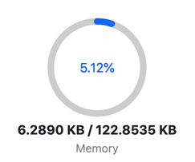

# RAM

## 개요

이오스에서 데이터를 저장하는 **개인 저장 공간**을 정량적으로 표현한 자원이다.

개인 저장 공간이라는 표현에 주목할 필요가 있다. 내가 보유하고 있는 토큰 데이터도 개인 저장 공간을 사용한다. 그래서 여러 개의 토큰을 계속해서 에어드롭 받다 보면 어느샌가 나의 RAM 자원이 계속해서 늘어나는 것을 볼 수 있다. 토큰뿐만 아니라 스마트 컨트랙트를 통하여 생성된 데이터들을 저장하는 용도로 사용된다. 단위는 우리가 잘 알고 있는 KB/MB와 같은 데이터 크기를 사용한다.

이오스 메인넷을 오픈할 때 총 구매 가능한 RAM 용량을 64GB 이었다. RAM 용량을 정하는 기준은 사실 모르겠다. 공식 문서에도 64GB를 지정한 이유에 대해서는 나와있지 않다. 너무 많으면 네트워크 동작에 무리가 갈 가능성이 있고 너무 적다면 다양한 [DApp](../d/dapp.md) 이 나오기 힘드니 적당한 타협점을 찾은것이 64GB 이었을 것이라 추측한다. 현재는 램을 추가로 설정하여 총 100GB를 사용할 수 있다.

메인넷 오픈당시 사재기 열풍으로 엄청나게 논란이 많았던 자원이다. 램 매매 시스템은 [bancor](../b/bancor.md) 알고리즘으로 자동화 구현이 되어 있다. 한마디로 제 3자의 개입 없이 자동으로 거래되는 시스템이 구축되어 있는 것이다. 그러나 순진한 개발자들의 장밋빛 상상과는 틀리게 이오스가 메인넷 오픈을 하자마자 엄청난 사재기 열풍으로 이오스 전체 네트워크의 램이 90% 가까이 전량 판매가 되고 램 가격은 하늘로 치솟아 정상적인 [DApp](../d/dapp.md) 의 개발과 출현을 막는 주요 원인이 되었다. 그 덕분에 이오스에 진출하려고 했던 많은 [DApp](../d/dapp.md) 개발자들은 높은 비용 때문에 포기하여야 했었다. 지금은 코인시장의 떡락과 함께 어느정도 안정기를 보내고 있다.

## RAM Market

[RAM](ram.md)을 사고 팔수 있는 마켓이다.

다른 자원과 달리 [RAM](ram.md)은 마켓이 존재하며 사고 팔때마다 수요와 공급 법칙에 의하여 유동적으로 시세가 변한다. 유동적으로 가격이 변하는 알고리즘은 [bancor](../b/bancor.md) 알고리즘을 사용했으며, 코드는 [eosio.system](../e/eosio.system.md) 컨트랙트에 구현되어 있다.

### 수수료

[CPU](../c/cpu.md),[NET](../n/net.md) 자원의 경우 수수료가 없지만 [RAM](ram.md) 의 경우 매매시 1%\( 구매시 0.5%, 판매시 0.5%\) 의 **수수료**가 발생하며 인플레이션을 막기 위하여 소각된다. 정확하게 표현하자면 소각되는건 아니고 [eosio.ramfee](../e/eosio.ramfee.md) 라는 계정에 저장된다. 

## RAM을 측정하는 단위

​[RAM](ram.md) 단위를 보게되면 KB 으로 미루어 보아 데이터 크기 라는것을 알수 있다.

발행량은 메인넷 오픈 당시 64GB으로 시작하였고 현재는 100GB으로 설정되어 있다. [eosio.system](../e/eosio.system.md) 에서 총 RAM 용량을 변경할 수 있다. 램 용량은 [BP](../b/bp.md)들의 합의로 변경할 수 있다.

